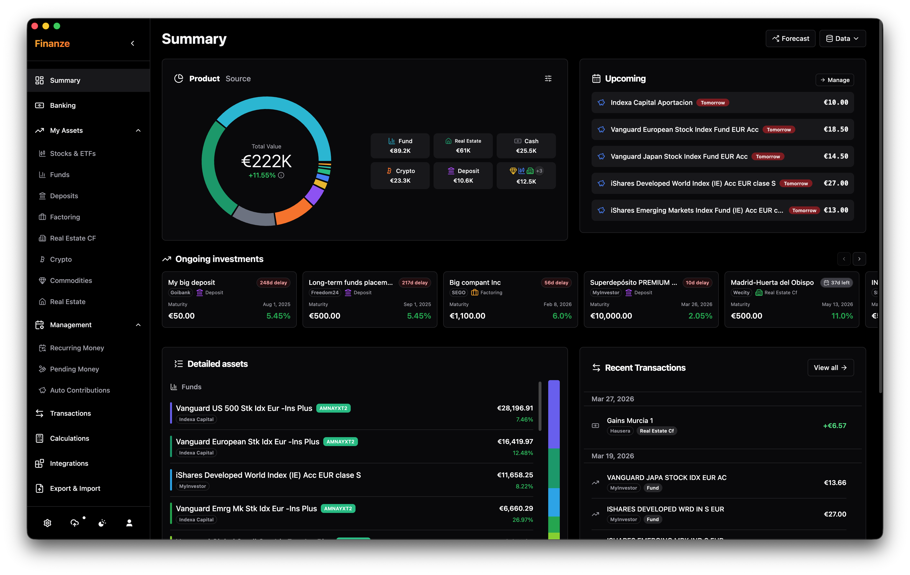
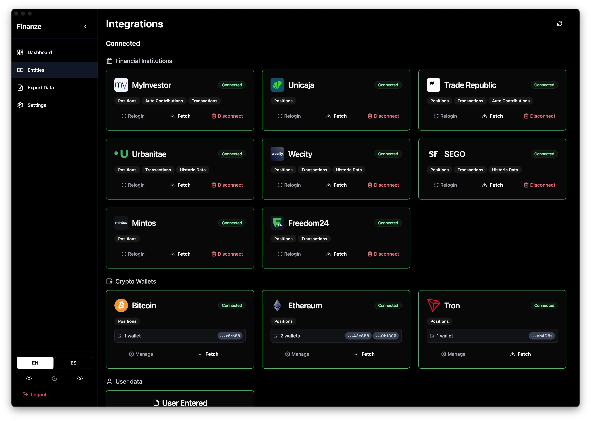
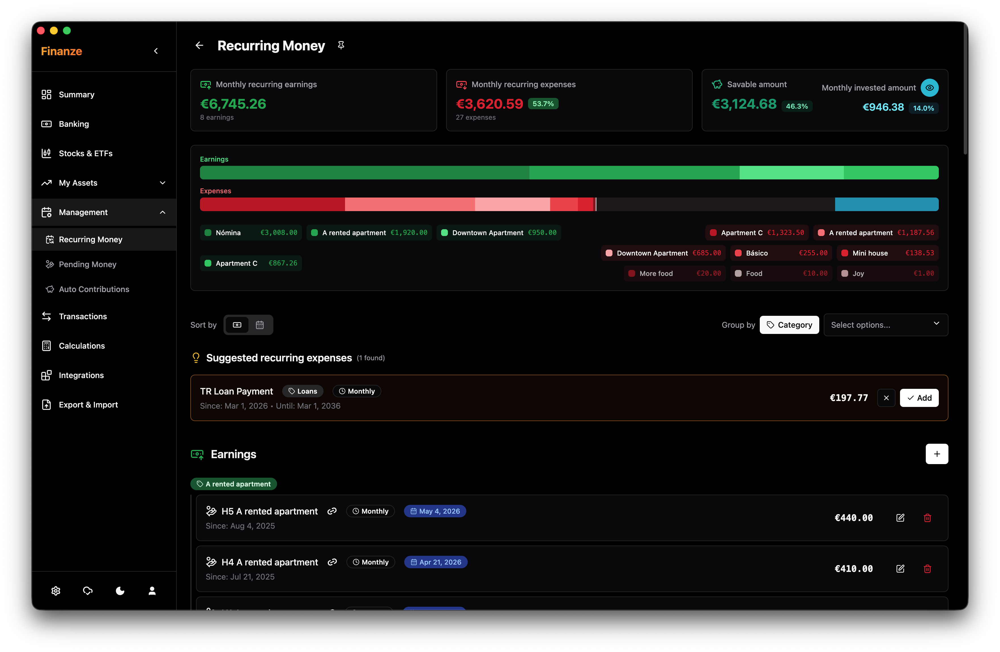
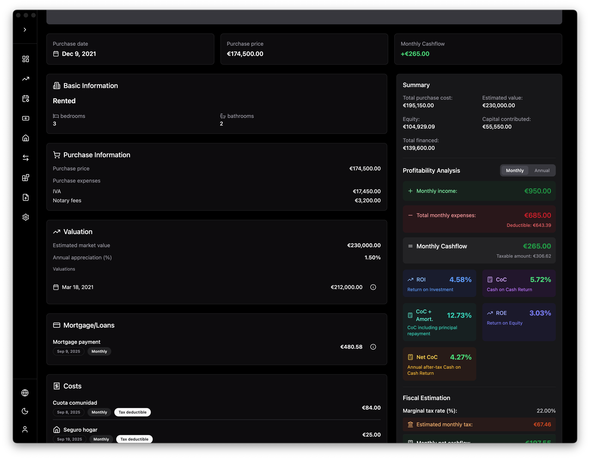
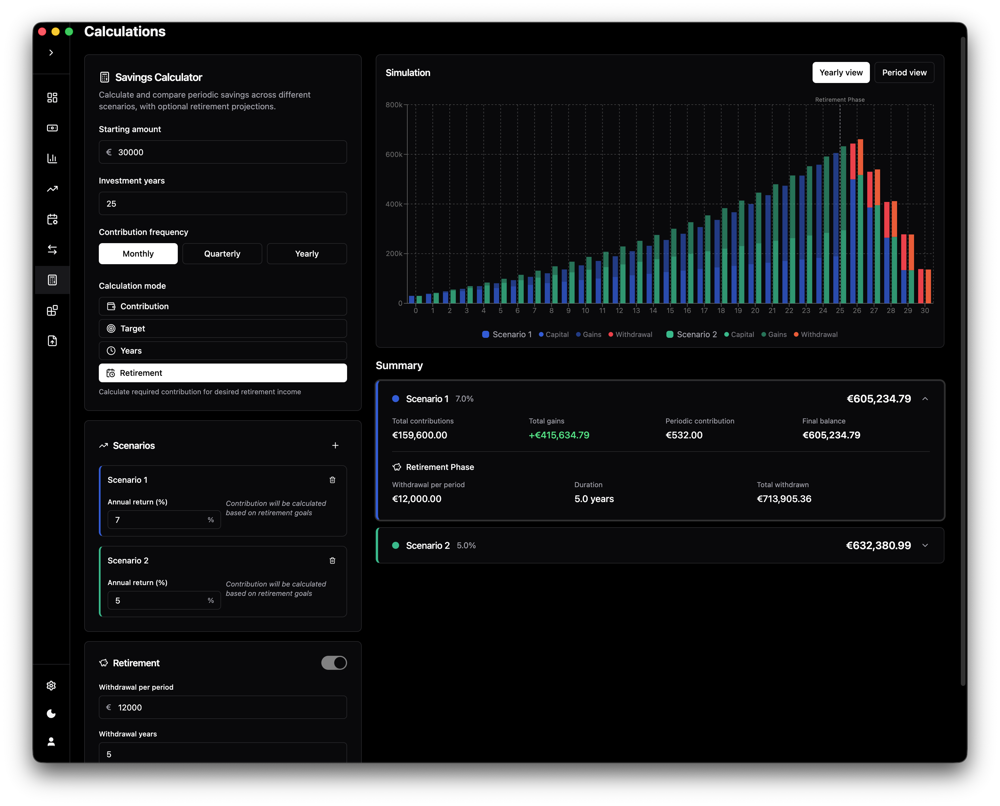
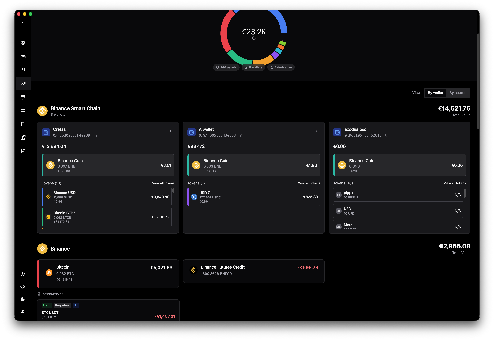

<p align="center"></p>
<h1 align="center">Finanze: private & self-hosted portfolio manager</h1>

<p align="center">
<a href="https://finanze.me">Finanze</a> is a private, self-hosted portfolio manager that allows to aggregate financial data from various banking and investment
platforms. It supports multiple sources, asset types (real estate, crypto, funds, stocks...) and features, providing a unified interface to gather and process financial information.
</p>

<h2 align="center"></h2>

<p align="middle">
  
   
   
  
   
   
</p>

## Table of Contents

- [Features](#features)
- [Usage](#usage)
- [Development](#development)
- [Credits](#credits)

## Features

- 🔄 Fetch financial data from multiple entities
- 💼 Support for various financial products:
    - 📈 Stocks, funds, portfolios, accounts, real estate crowdfunding, cryptocurrencies, etc. from real sources or
      imported
    - 🏠 Real estate investments with a variety of metrics and KPIs
    - 🪙 Commodities with market value tracking
- 💵 Earnings and expenses tracking with periodic asset contributions to forecast future positions
- 💱 Multicurrency support with automatic exchange rate fetching
- 🔐 Local encrypted database for secure data storage
- 📤 Dynamic and customizable data export to Google Sheets
- 📥 Manual data importing
- ⚙️ Highly configurable with templating for exports and imports
- 📊 Complex savings & retirement calculator with multiple scenarios and variables

### Supported Assets by Financial Entity & Crypto Exchanges

| Financial Entity    | Accounts | Cards | Funds | Stock/<br>ETFs | Deposits | Portfolios | Loans/<br>Mortgages | Crypto | Bonds | Specific            |
|---------------------|----------|-------|-------|----------------|----------|------------|---------------------|--------|-------|---------------------|
| Urbanitae           | ✅        | -     | -     | -              | -        | -          | -                   | -      | -     | Lending Investments |
| MyInvestor          | ✅        | ✅     | ✅     | ✅              | ✅        | ✅          | ❌                   | -      | -     |                     |
| SEGO                | ✅        | -     | -     | -              | -        | -          | -                   | -      | -     | Factoring           |
| Trade Republic      | ✅        | -     | ✅     | ✅              | -        | -          | -                   | ✅      | ❌     | Private Markets     |
| Unicaja             | ✅        | ✅     | ❌     | ❌              | ❌        | -          | ✅                   | -      | -     |                     |
| Wecity              | ✅        | -     | -     | -              | -        | -          | -                   | -      | -     | Investments         |
| Mintos              | ✅        | -     | -     | ❌              | ❌        | -          | -                   | -      | ❌     | Crowdlending        |
| Freedom24           | ✅        | -     | -     | ❌              | -        | -          | -                   | ❌      | ❌     |                     |
| Indexa Capital      | ✅        | -     | ✅️    | -              | -        | ✅️         | -                   | -      | -     |                     |
| ING                 | ✅        | ✅     | ✅️    | ✅              | ❌        | -          | ❌                   | -      | -     |                     |
| Grupo Cajamar       | ✅        | ✅     | ❌️    | ❌              | ❌        | -          | ✅                   | -      | -     |                     |
| DEGIRO              | ✅        | -     | ✅️    | ✅️             | -        | -          | -                   | -      | -     |                     |
| Interactive Brokers | ✅        | -     | ❌     | ✅️ Stocks      | -        | -          | -                   | -      | ❌     |                     |

| Crypto Exchange | Crypto | Specific |
|-----------------|--------|----------|
| Binance         | ✅ Spot | Futures  |

#### GoCardless Integration

GoCardless provides PSD2 compliant bank account information for many EU/UK banks, for institutions not natively
supported this is the way to get account related data.

### Financial Entity & Crypto Exchanges Features

Not all entities support the same features, in general we can group data in the following categories:

- **Global Position**: current financial position including the current state of assets mentioned above, this is
  supported by all entities.
- **Periodic Contributions**: automatic periodic contributions made to investments such as Funds (MyInvestor) or
  Stocks/ETFs (Trade Republic).
- **Transactions**: all the account/investment related transactions, interest payments, stock of fund operations, asset
  maturity, fees...
- **Investment Historic**: aggregates past positions and TXs to create a history of past and current investments (
  deposits are not included here).

| Financial Entity    | Global Position | Periodic<br>Contributions | Transactions<br>(inv. related) | Investment<br>Historic |
|---------------------|-----------------|---------------------------|--------------------------------|------------------------|
| Urbanitae           | ✅               | -                         | ✅                              | ✅                      |
| MyInvestor          | ✅               | ✅                         | ✅                              | ❌                      |
| SEGO                | ✅               | -                         | ✅                              | ✅                      |
| Trade Republic      | ✅               | ✅                         | ✅                              | -                      |
| Unicaja             | ✅               | ✅                         | ❌                              | -                      |
| Wecity              | ✅               | -                         | ✅                              | ✅                      |
| Mintos              | ✅               | -                         | ❌                              | ❌                      |
| Freedom24           | ✅               | -                         | ✅                              | ❌                      |
| Indexa Capital      | ✅               | -                         | ✅                              | -                      |
| ING                 | ✅               | ✅                         | ✅                              | -                      |
| Grupo Cajamar       | ✅               | -                         | ❌                              | -                      |
| DEGIRO              | ✅               | ❌                         | ✅                              | -                      |
| Interactive Brokers | ✅               | ❌                         | ✅⚠️                            | -                      |

| Crypto Exchange | Global Position | Periodic<br>Contributions | Transactions<br>(inv. related) | Investment<br>Historic |
|-----------------|-----------------|---------------------------|--------------------------------|------------------------|
| Binance         | ✅ Spot          | ❌                         | ✅️                             | -                      |

### Financial Entity notes

Some entities require a 2FA to login or get its data, which doesn't allow to background update, this applies to the
following ones:

- **SEGO** (e-mail)
- **Trade Republic** (mobile app or SMS)
- **Wecity** (SMS)
- Sometimes **MyInvestor** (SMS) and may ask sometimes for captcha
- **DEGIRO** (mobile app confirmation)

Important points to remark:

- **Unicaja** if not using the desktop app, it requires setting `UNICAJA_ABCK` environment variable to login, as it uses
  Akamai for anti
  bot protection.
- **Mintos** needs Selenium to resolve reCAPTCHA when not using frontend.
- **ING** and **IBKR** only work via frontend, as require user interaction to log in.
- **Freedom24** D-Account interest (swaps) txs were supported and its related transactions, but not anymore since its
  removal.

### Crypto

Crypto is a bit special, as it is not a financial entity, but a financial product. To add it just set up a wallet,
currently the following are supported:

- **Bitcoin** (xpub supported)
- **Ethereum**: ERC20 tokens are supported too.
- **Litecoin** (xpub supported)
- **Tron**: TRC20 tokens are supported too.
- **Binance Smart Chain**: BSC tokens are supported too (requires Etherscan integration setup with an API Key).

At the moment the only available feature for crypto is **Global Position**, transactions are WIP.

Some financial entities such as Trade Republic support crypto too.

### Commodities

Manual commodity input is feature that allows to track market value for them. Currently, the following are supported:

- **Gold**
- **Silver**
- **Platinum**
- **Palladium**

### Export and Importing

This project allows to create specific tables in different formats, aggregating and formatting the scraped data.
Currently two modalities are supported:

- **Google Sheets**: supported for exporting and importing, which requires to set up a Google Service Account.
  Also keep in mind that in this modality when importing, the spreadsheets data is considered like a fake source, so
  each time data is
  imported will override previous data from Google Sheets (won't affect real data or manually provided).
- **Files**: CSV, TSV and Excel files are supported for exporting and importing, no special setup is needed for this.

#### Templating

Exporting and importing is highly customizable using templates, which allows to define the structure of the tables,
data formatting, filters and other features. It's required for importing.

Check [Export & Import Configuration](#export--import-configuration) for more technical info.

## Usage

### Download

Download the latest version of the app from the [Releases](https://github.com/finanze/finanze/releases) for your
OS.

### Note for macOS

When opening the app for the first time, you may encounter a security warning/error. To bypass this follow the steps
below:

1. Remove the quarantine attribute from the application using the following command in the terminal:

```sh
cd /Applications && xattr -d com.apple.quarantine Finanze.app
```

2. Open the application as usual.
3. _(Disclaimer)_ If it still doesn't open, or you get some kind of "Operation not permitted" error in the previous
   command, then do the following:
    - Go to `System Settings → Privacy & Security → Full Disk Access` and add or enable `Terminal` in the list.

### Docker

Two Docker images are available, a Selenium one (latest-selenium) and a light one (latest-no-selenium).

The first one is required for Mintos, as it contains Selenium and reCAPTCHA resolution related Python and SO
dependencies (like ffmpeg).
In case you don't use Mintos, latest-no-selenium is highly recommended.

Both are available at Docker Hub [finanze/finanze](https://hub.docker.com/r/finanze/finanze).

Frontend is available at [finanze/finanze-frontend](https://hub.docker.com/r/finanze/finanze-frontend).

Checkout example [docker-compose.yml](docker-compose.yml) for a complete setup.

## Development

This project requires `Python 3.13` or ` 3.14` for backend, desktop app and Docker use `3.14`, while Pyodide uses
`3.13`.
For the frontend use `pnpm`, and node 24.

### Setup

1. Clone the repository:

    ```sh
    git clone https://github.com/finanze/finanze.git
    cd finanze
    ```

2. Create a virtual environment and activate it (recommended Pyenv for version management):

    ```sh
    python3 -m venv venv
    source venv/bin/activate
    ```

3. Install the required dependencies:

    ```sh
    pip install -r requirements.txt -r requirements-dev.txt -r requirements-lint.txt -r requirements-packaging.txt
    pip install -r requirements-selenium.txt  # If you want to use Selenium for reCAPTCHA
    pre-commit install
    ```

4. Setup frontend:

    ```sh
    cd frontend/app
    pnpm install
    pnpm install:pyodide # For mobile app initial setup, it will download Pyodide and all required Python dependencies for mobile backend
    ```

5. Run it

    ```sh
    python ./finanze/finanze --port 7592 --data-dir .storage --log-dir .storage/logs --log-level DEBUG --third-party-log-level DEBUG

    cd frontend/app
    pnpm dev          # For electron desktop app
    pnpm dev:mobile   # For mobile app (web feature limited, but useful for basic development and testing)
    pnpm cap:ios      # For iOS development (requires Xcode and Mac)
    pnpm cap:android  # For Android development (requires Android Studio and related SDKs
    pnpm cap:sync     # To sync changes to native projects after frontend development
    ```

### How configuration works?

Checking [example_config.yml](resources/example_config.yml) could be useful in order to see some examples of export
tables and summary dashboards.

### Environment Variables

Checkout example docker-compose.yml for the environment variables that can be used to override the default config, most
important ones are::

- `USERNAME` and `PASSWORD` optional, to auto start session on load.
- `MULTI_USER` optional, to allow multiple user sign up (only recommended for local development).
- Other Selenium related ones.

## Attributions & Credits

- Powered by [CoinGecko](https://www.coingecko.com/).
- Powered by [CryptoCompare](https://www.cryptocompare.com/).
- Trade Republic client is based on project [pytr-org/pytr](https://github.com/pytr-org/pytr), although it has been
  heavily
  modified to allow resumable sessions, some extra data, fetch non-repeatable transactions and other minor changes, this
  library has been vital for this
  project.
- SQLCipher pre-built dependency [laggykiller/sqlcipher3](https://github.com/laggykiller/sqlcipher3)
- Selenium reCAPTCHA resolution is based
  on [sarperavci/GoogleRecaptchaBypass](https://github.com/sarperavci/GoogleRecaptchaBypass/tree/selenium)
  project, using a slightly modified version of Selenium version. In an attempt of using Playwright I made an adaptation
  for
  it [here](finanze/infrastructure/scrapers/mintos/recaptcha_solver_playwright.py), it works, but has some troubles
  with headless mode.
