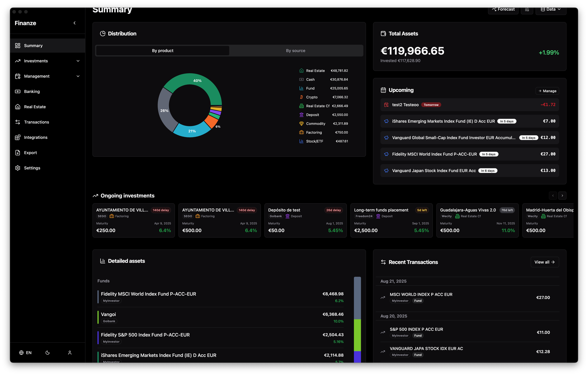
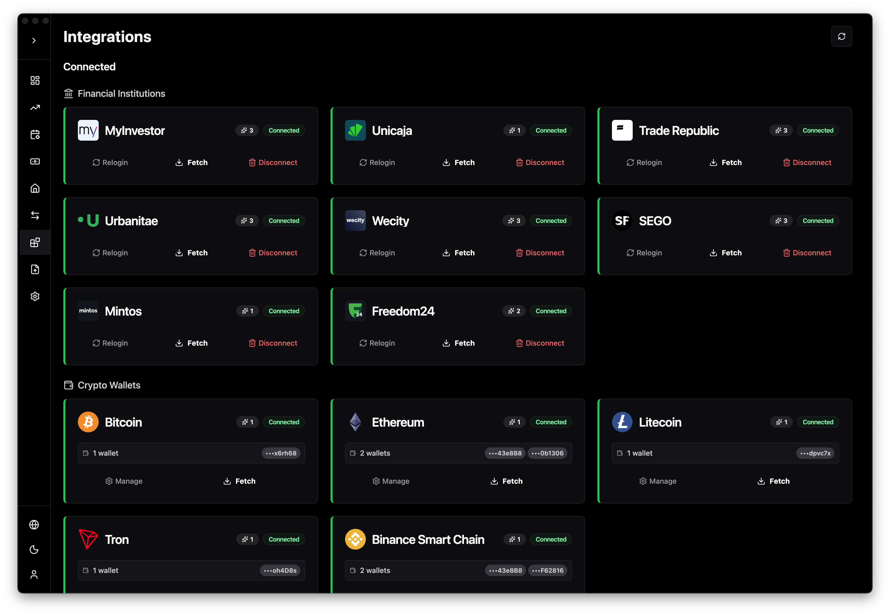
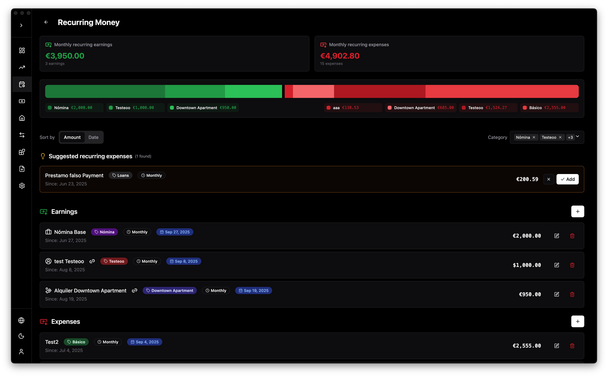

<p align="center"></p>
<h1 align="center">Finanze</h1>

<p align="center">
An application designed to aggregate financial data from various banking and investment
platforms. It supports multiple entities and features, providing a unified interface to gather and process financial
information.
</p>

<h2 align="center"></h2>

<p align="middle">
  
   
   
   
</p>

## Table of Contents

- [Features](#features)
- [Usage](#usage)
- [Development](#development)
- [Credits](#credits)

## Features

- 🔄 Fetch financial data from multiple entities
- 💼 Support for various financial products:
    - 📈 Stocks, funds, portfolios, accounts, real estate crowdfunding, cryptocurrencies, etc. from real sources or
      imported
    - 🏠 Real estate investments with a variety of metrics and KPIs
    - 🪙 Commodities with market value tracking
- 💵 Earnings and expenses tracking with periodic asset contributions to forecast future positions
- 💱 Multicurrency support with automatic exchange rate fetching
- 🔐 Local encrypted database for secure data storage
- 📤 Dynamic and customizable data export to Google Sheets
- 📥 Manual data importing

### Supported Assets by Financial Entity

| Entity         | Accounts | Cards | Funds | Stock/<br>ETFs | Deposits | Portfolios | Loans/<br>Mortgages | Crypto | Bonds | Specific            |
|----------------|----------|-------|-------|----------------|----------|------------|---------------------|--------|-------|---------------------|
| Urbanitae      | ✅        | -     | -     | -              | -        | -          | -                   | -      | -     | Lending Investments |
| MyInvestor     | ✅        | ✅     | ✅     | ✅              | ✅        | ✅          | ❌                   | -      | -     |                     |
| SEGO           | ✅        | -     | -     | -              | -        | -          | -                   | -      | -     | Factoring           |
| Trade Republic | ✅        | -     | ✅     | ✅              | -        | -          | -                   | ETCs   | ❌     |                     |
| Unicaja        | ✅        | ✅     | ❌     | ❌              | ❌        | -          | ✅                   | -      | -     |                     |
| Wecity         | ✅        | -     | -     | -              | -        | -          | -                   | -      | -     | Investments         |
| Mintos         | ✅        | -     | -     | ❌              | ❌        | -          | -                   | -      | ❌     | Crowdlending        |
| Freedom24      | ✅        | -     | -     | ❌              | -        | -          | -                   | ❌      | ❌     |                     |
| Indexa Capital | ✅        | -     | ✅️    | -              | -        | ✅️         | -                   | -      | -     |                     |
| ING            | ✅        | ✅     | ✅️    | ❌              | ❌        | -          | ❌                   | -      | -     |                     |

#### GoCardless Integration

GoCardless provides PSD2 compliant bank account information for many EU/UK banks, for institutions not natively
supported this is the way to get account related data.

### Financial Entity Features

Not all entities support the same features, in general we can group data in the following categories:

- **Global Position**: current financial position including the current state of assets mentioned above, this is
  supported by all entities.
- **Periodic Contributions**: automatic periodic contributions made to investments such as Funds (MyInvestor) or
  Stocks/ETFs (Trade Republic).
- **Transactions**: all the account/investment related transactions, interest payments, stock of fund operations, asset
  maturity, fees...
- **Investment Historic**: aggregates past positions and TXs to create a history of past and current investments (
  deposits are not included here).

| Entity         | Global Position | Periodic<br>Contributions | Transactions<br>(inv. related) | Investment<br>Historic |
|----------------|-----------------|---------------------------|--------------------------------|------------------------|
| Urbanitae      | ✅               | -                         | ✅                              | ✅                      |
| MyInvestor     | ✅               | ✅                         | ✅                              | ❌                      |
| SEGO           | ✅               | -                         | ✅                              | ✅                      |
| Trade Republic | ✅               | ✅                         | ✅                              | -                      |
| Unicaja        | ✅               | ✅                         | -                              | -                      |
| Wecity         | ✅               | -                         | ✅                              | ✅                      |
| Mintos         | ✅               | -                         | ❌                              | ❌                      |
| Freedom24      | ✅               | -                         | ✅                              | ❌                      |
| Indexa Capital | ✅               | -                         | ✅                              | -                      |
| ING            | ✅               | ✅                         | ✅                              | -                      |

### Financial Entity notes

Some entities require a 2FA to login or get its data, which doesn't allow to background update, this applies to the
following ones:

- **SEGO** (e-mail)
- **Trade Republic** (mobile app or SMS)
- **Wecity** (SMS)
- Sometimes **MyInvestor** (SMS)

Important points to remark:

- **Unicaja** if not using the desktop app, it requires setting `UNICAJA_ABCK` environment variable to login, as it uses
  Akamai for anti
  bot protection.
- **Mintos** needs Selenium to resolve reCAPTCHA when not using frontend.
- **ING** only works via frontend, as it requires user interaction to log in.
- **Freedom24** D-Account interest (swaps) txs were supported and its related transactions, but not anymore since its
  removal.

### Crypto

Crypto is a bit special, as it is not a financial entity, but a financial product. To add it just set up a wallet,
currently the following are supported:

- **Bitcoin**
- **Ethereum**: ERC20 tokens are supported too, currently **USDT** and **USDC** are supported.
- **Litecoin**
- **Tron**: TRC20 tokens are supported too, same as ETH.
- **Binance Smart Chain**: BSC tokens are supported too (requires Etherscan integration setup with an API Key).

At the moment the only available feature for crypto is **Global Position**, transactions are WIP.

### Commodities

Manual commodity input is feature that allows to track market value for them. Currently, the following are supported:

- **Gold**
- **Silver**
- **Platinum**
- **Palladium**

### Google Sheets export

This project allows to create complex dashboards and tables in Google Sheets, aggregating and formatting the scraped
data. Check [Export & Import Configuration](#export--import-configuration) for more technical info.

## Usage

### Download

Download the latest version of the app from the [Releases](https://github.com/finanze/finanze/releases) for your
OS.

### Note for macOS

When opening the app for the first time, you may encounter a security warning/error. To bypass this follow the steps
below:

1. Remove the quarantine attribute from the application using the following command in the terminal:

```sh
cd /Applications && xattr -d com.apple.quarantine Finanze.app
```

2. Open the application as usual.
3. *(Disclaimer)* If it still doesn't open, or you get some kind of "Operation not permitted" error in the previous
   command, then do the following:
    - Go to `System Settings → Privacy & Security → Full Disk Access` and add or enable `Terminal` in the list.

## Development

### Docker

Two Docker images are available, a Selenium one (latest-selenium) and a light one (latest-no-selenium). The first one is
the default, which currently is
needed for Mintos, as it contains Selenium and reCAPTCHA resolution related Python and SO dependencies (like ffmpeg).

Both are available at Docker Hub [marcosav/finanze](https://hub.docker.com/r/marcosav/finanze).

Frontend is available at [marcosav/finanze-frontend](https://hub.docker.com/r/marcosav/finanze-frontend).

### Setup

This project requires `Python 3.11`.

1. Clone the repository:
    ```sh
    git clone https://github.com/finanze/finanze.git
    cd finanze
    ```

2. Create a virtual environment and activate it (recommended Pyenv for version management):
    ```sh
    python3 -m venv venv
    source venv/bin/activate
    ```

3. Install the required dependencies:
    ```sh
    pip install -r requirements.txt
    pip install -r requirements-selenium.txt  # If you want to use Selenium for reCAPTCHA
    ```

### Export & Import Configuration

Checking [example_config.yml](resources/example_config.yml) could be useful in order to see some examples of export
tables
and summary dashboards.

### Environment Variables

Checkout example docker-compose.yml for the environment variables that can be used to override the default config, most
important ones are::

- `USERNAME` and `PASSWORD` optional, to auto start session on load.
- `MULTI_USER` optional, to allow multiple user sign up (only recommended for local development).
- Other Selenium related ones.

### Credentials

There are two ways of handling this, the default and recommended one is storing them in the encrypted database,
this is done using the login endpoint showed in the [Usage](#usage) section. This mode is enabled by default.

Credentials can also be stored in the environment variables like `{ENTITY_NAME}_USERNAME` and `{ENTITY_NAME}_PASSWORD`.
Except for `MYI_USERNAME` and `MYI_PASSWORD` in MyInvestor case, and `TR_PHONE` and `TR_PIN` for Trade Republic.
This is enabled by setting `CREDENTIAL_STORAGE` environment variable to `ENV`.

Also, credentials_reader.py is a basic and unsecure implementation to retrieve credentials from environments, there you
can get the needed environment names.

## Credits

- Selenium reCAPTCHA resolution is based
  on [sarperavci/GoogleRecaptchaBypass](https://github.com/sarperavci/GoogleRecaptchaBypass/tree/selenium)
  project, using a slightly modified version of Selenium version. In an attempt of using Playwright I made an adaptation
  for
  it [here](finanze/infrastructure/scrapers/mintos/recaptcha_solver_playwright.py), it works, but has some troubles
  with headless mode.
- Trade Republic client is based on project [pytr-org/pytr](https://github.com/pytr-org/pytr), although it has been
  heavily
  modified to allow resumable sessions, some extra data, fetch non-repeatable transactions and other minor changes, this
  library has been vital for this
  project.
- SQLCipher pre-built dependency [rotki/pysqlcipher3](https://github.com/rotki)